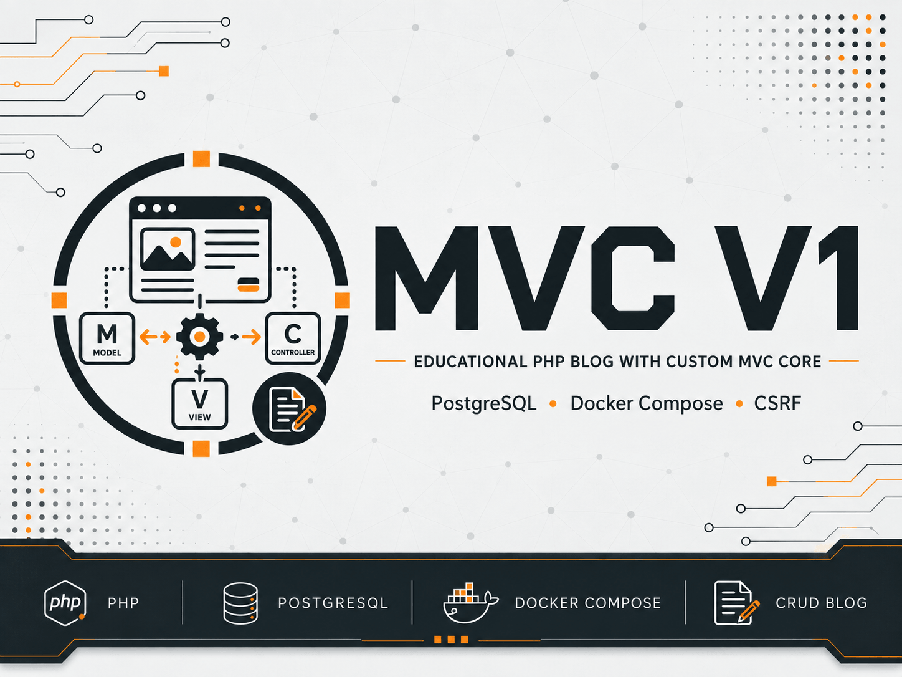
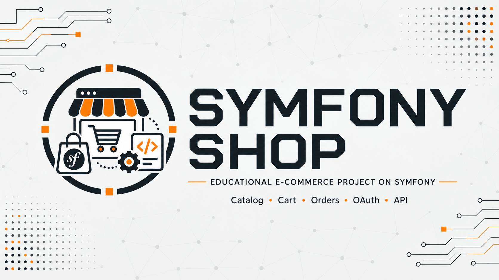
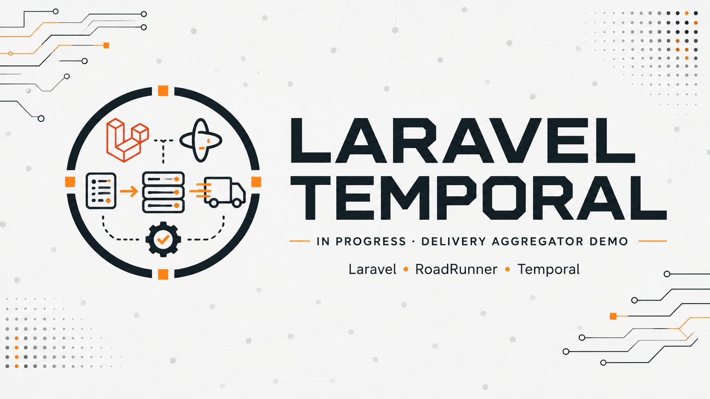
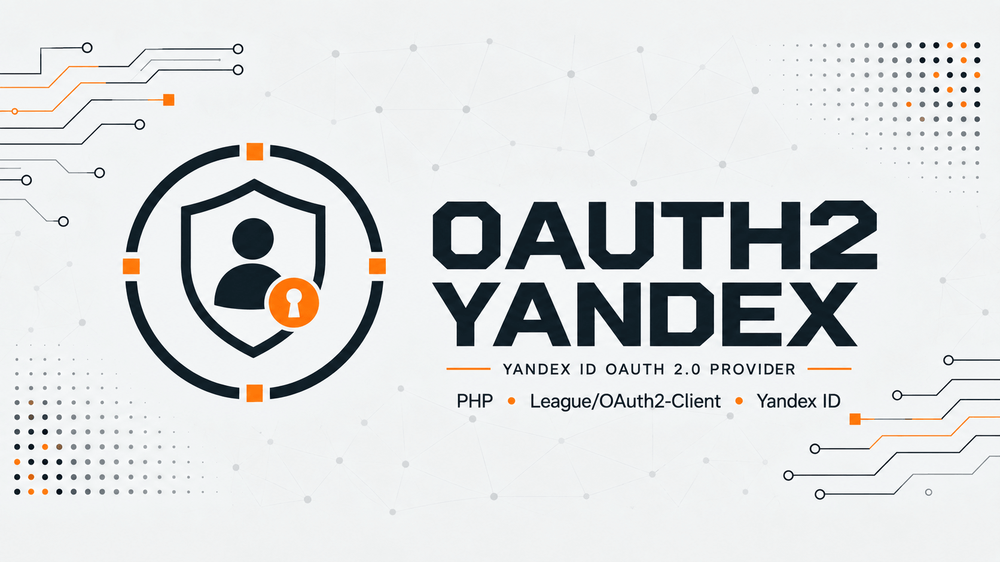
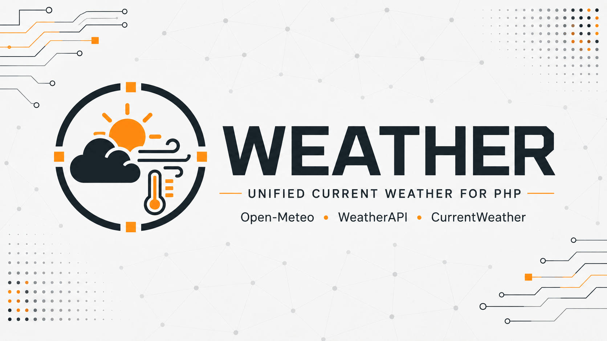
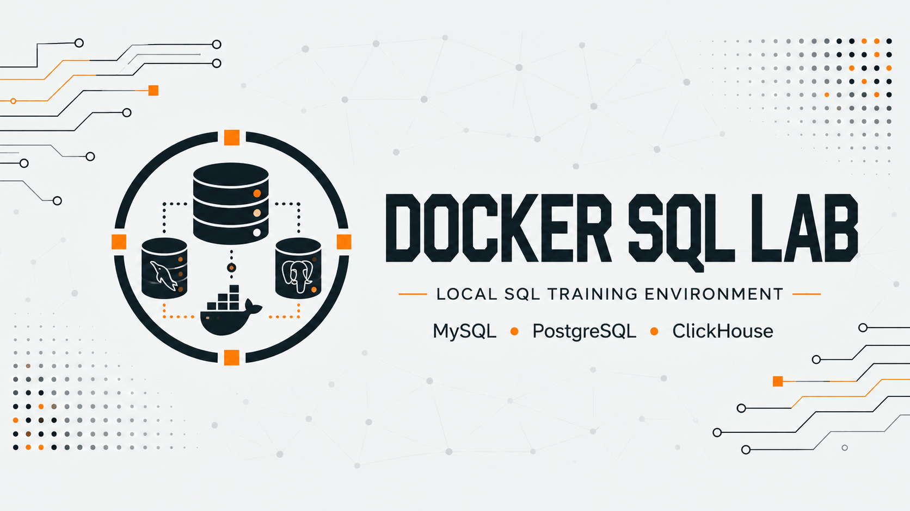
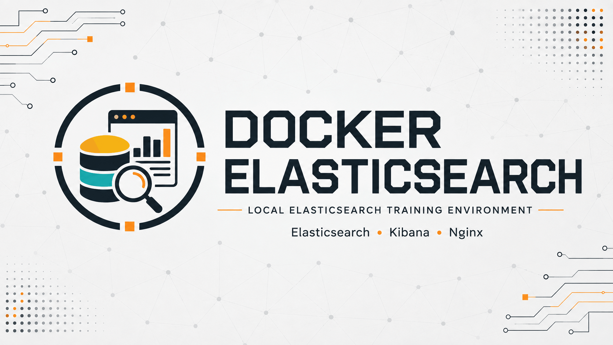
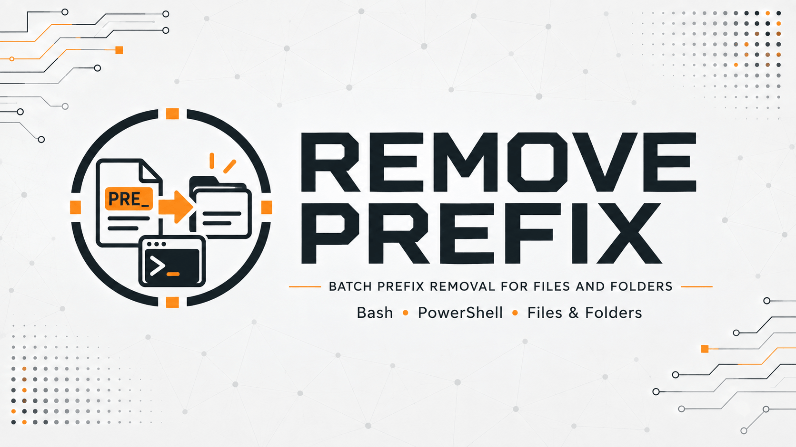

## Choose language

| Русский | English | Español | 中文 | Français | Deutsch |
|---|---|---|---|---|---|
| [Русский](https://github.com/yaleksandr89/yaleksandr89/blob/master/README.md) | **Selected** | [Español](https://github.com/yaleksandr89/yaleksandr89/blob/master/langs/README_es.md) | [中文](https://github.com/yaleksandr89/yaleksandr89/blob/master/langs/README_zh.md) | [Français](https://github.com/yaleksandr89/yaleksandr89/blob/master/langs/README_fr.md) | [Deutsch](https://github.com/yaleksandr89/yaleksandr89/blob/master/langs/README_de.md) |

---

I work with backend logic, API integrations, legacy projects, and internal corporate systems. The repositories include projects, PHP packages, and small tools for experiments, practice, and everyday tasks.

---

## Stack

<table>
  <thead>
    <tr>
      <th align="left">Area</th>
      <th align="left">Technologies</th>
    </tr>
  </thead>
  <tbody>
    <tr>
      <td valign="middle"> <strong>Languages</strong></td>
      <td valign="middle">PHP · SQL · JavaScript</td>
    </tr>
    <tr>
      <td valign="middle"> <strong>PHP</strong></td>
      <td valign="middle">Native PHP · Symfony · Laravel · Yii</td>
    </tr>
    <tr>
      <td valign="middle"> <strong>Databases</strong></td>
      <td valign="middle">PostgreSQL · MySQL · MariaDB</td>
    </tr>
    <tr>
      <td valign="middle"> <strong>Cache & search</strong></td>
      <td valign="middle">Redis · Elasticsearch · Sphinx</td>
    </tr>
    <tr>
      <td valign="middle"> <strong>Platform / DevOps</strong></td>
      <td valign="middle">Linux · Docker · Kubernetes</td>
    </tr>
    <tr>
      <td valign="middle"> <strong>Git / Forge / CI</strong></td>
      <td valign="middle">Git · GitHub · GitLab · Gitea · GitHub Actions</td>
    </tr>
    <tr>
      <td valign="middle"> <strong>Development</strong></td>
      <td valign="middle">PhpStorm</td>
    </tr>
    <tr>
      <td valign="middle"> <strong>AI</strong></td>
      <td valign="middle">ChatGPT Projects · Codex · OpenCode · LM Studio</td>
    </tr>
    <tr>
      <td valign="middle"> <strong>Local LLM</strong></td>
      <td valign="middle">Qwen3.8 27B · Qwen2.5-Coder 14B · Qwen3.5 9B</td>
    </tr>
  </tbody>
</table>

---

## PHP

  

### Projects

<table>
  <tr>
    <td align="center" valign="top" width="50%">
        
      <a href="https://github.com/yaleksandr89/mvc-v1"><strong>mvc-v1</strong></a> 
      Native PHP  
      An example implementation of the MVC architectural pattern in native PHP with CRUD, PostgreSQL via PDO, and a Docker environment.
    </td>
    <td align="center" valign="top" width="50%">
        
      <a href="https://github.com/yaleksandr89/symfony-shop"><strong>symfony-shop</strong></a> 
      Symfony  
      An online store built with Symfony, PostgreSQL, Doctrine ORM, API Platform, OAuth, and a separate Vue frontend.
    </td>
  </tr>
  <tr>
    <td align="center" valign="top" width="50%">
        
      <a href="https://github.com/yaleksandr89/yii2-book-catalog"><strong>yii2-book-catalog</strong></a> 
      Yii2  
      A book and author catalog built with Yii2 and MySQL, with Docker, tests, and an external SMS integration.
    </td>
    <!--
    <td align="center" valign="top" width="50%">
        
      <strong>In progress...</strong> 
      Laravel  
      A Laravel project with RoadRunner and Temporal using a delivery aggregator as an example.
    </td>
    -->
    <td valign="top" width="50%"></td>
  </tr>
</table>

### PHP packages

<table>
  <tr>
    <td align="center" valign="top" width="50%">
        
      <a href="https://github.com/yaleksandr89/oauth2-yandex">GitHub</a> · <a href="https://packagist.org/packages/yaleksandr89/oauth2-yandex">Packagist</a>  
      OAuth 2.0 provider for Yandex ID integration via <code>league/oauth2-client</code>.
    </td>
    <td align="center" valign="top" width="50%">
        
      <a href="https://github.com/yaleksandr89/weather">GitHub</a> · <a href="https://packagist.org/packages/yaleksandr89/weather">Packagist</a>  
      PHP client for retrieving current weather by coordinates through Open-Meteo and WeatherAPI.
    </td>
  </tr>
  <!--
  <tr>
    <td align="center" valign="top" width="50%">
        
      <a href="https://github.com/yaleksandr89/archive-guard">GitHub</a> · In development  
      Safe inspection and controlled extraction of untrusted ZIP archives in PHP.
    </td>
    <td valign="top" width="50%"></td>
  </tr>
  -->
</table>

### Tools

<table>
  <tr>
    <td align="center" valign="top" width="50%">
        
      <a href="https://github.com/yaleksandr89/docker-sql-lab"><strong>docker-sql-lab</strong></a> 
      Docker · SQL  
      A local SQL learning environment with PostgreSQL, MySQL, and ClickHouse, plus ready-to-use demo tables.
    </td>
    <td align="center" valign="top" width="50%">
        
      <a href="https://github.com/yaleksandr89/docker-elasticsearch"><strong>docker-elasticsearch</strong></a> 
      Docker · Elasticsearch  
      A local Elasticsearch learning environment with Kibana and Nginx, including ICU and phonetic analysis for search experiments.
    </td>
  </tr>
  <tr>
    <td align="center" valign="top" width="50%">
        
      <a href="https://github.com/yaleksandr89/remove-prefix"><strong>remove-prefix</strong></a> 
      Bash · PowerShell  
      Cross-platform scripts for recursively removing prefixes in bulk from file and directory names.
    </td>
    <td valign="top" width="50%"></td>
  </tr>
</table>

---

## Contacts

<table>
  <tr>
    <td><strong>Email</strong></td>
    <td>
      <a href="mailto:y.aleksandr89@yandex.ru">y.aleksandr89@yandex.ru</a> ·
      <a href="mailto:y.aleksandr89@gmail.com">y.aleksandr89@gmail.com</a>
    </td>
  </tr>
  <tr>
    <td><strong>LinkedIn</strong></td>
    <td><a href="https://www.linkedin.com/in/yaleksandr89">in/yaleksandr89</a></td>
  </tr>
  <tr>
    <td><strong>VK</strong></td>
    <td><a href="https://vk.me/y.aleksandr89">vk.me/y.aleksandr89</a></td>
  </tr>
  <tr>
    <td><strong>Telegram</strong></td>
    <td><a href="https://t.me/yaleksandr89">@yaleksandr89</a></td>
  </tr>
</table>
